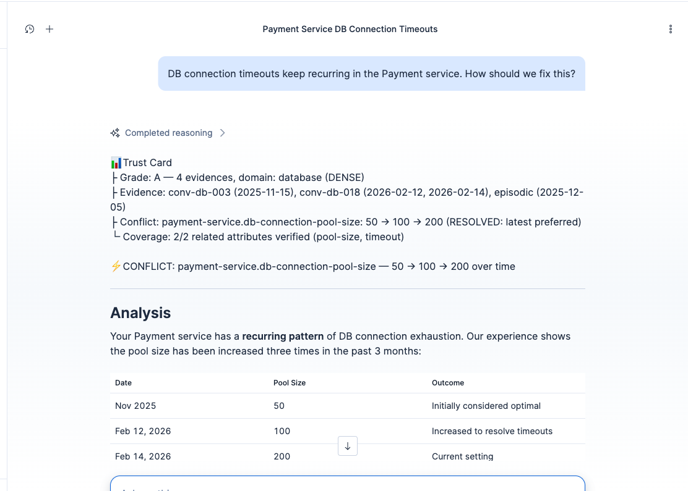
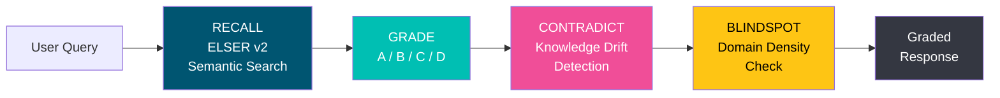
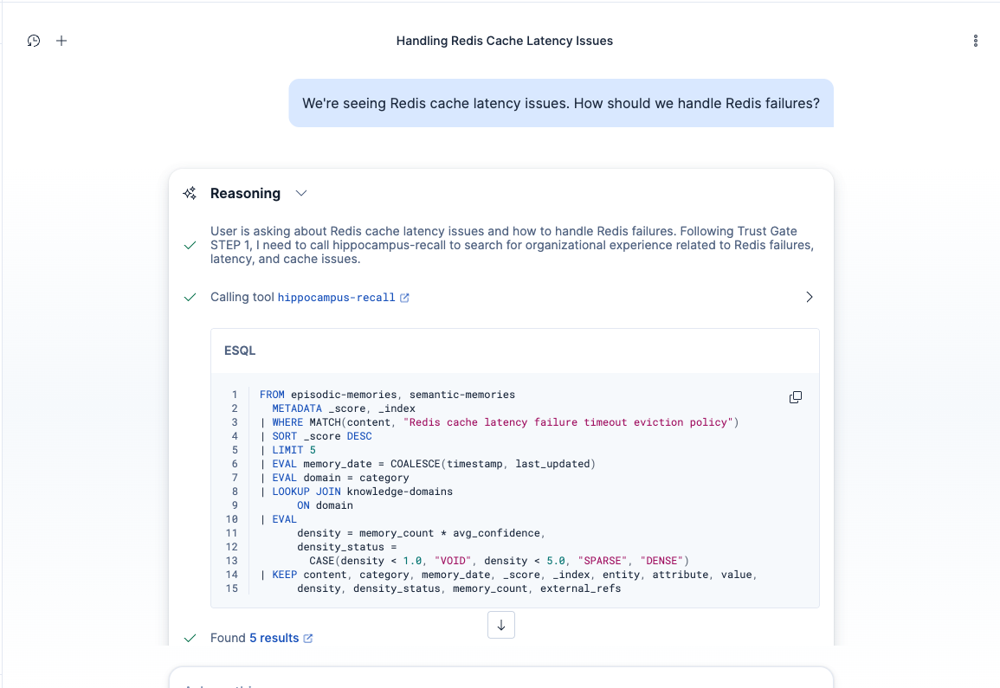
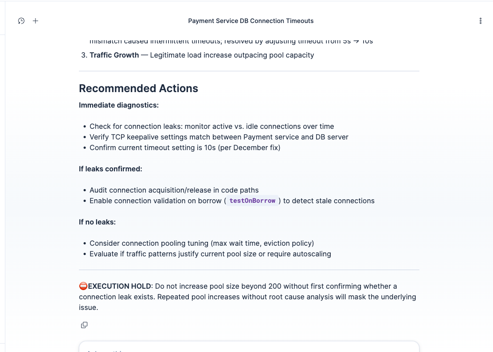
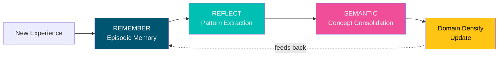
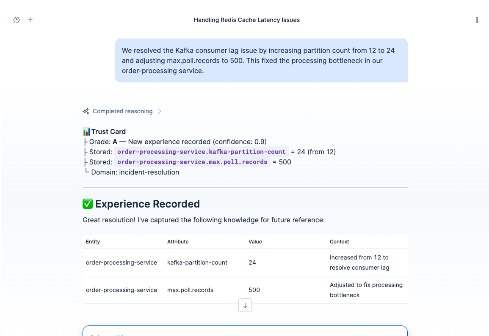
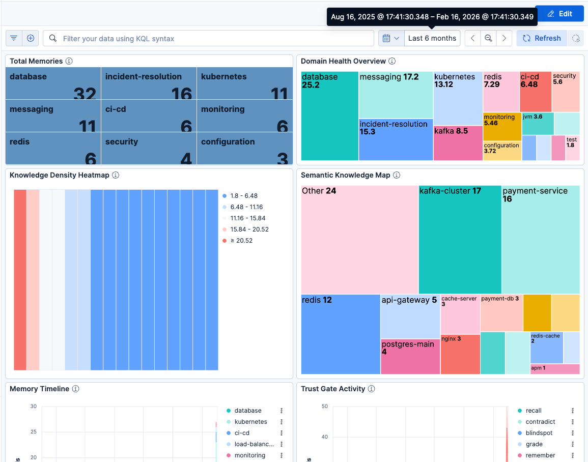

# Hippocampus: AI Agent Guardrails

[](https://www.elastic.co/elasticsearch)
[](https://www.elastic.co/kibana)
[](https://www.elastic.co/guide/en/machine-learning/current/ml-nlp-elser.html)
[](https://elasticsearch.devpost.com/)
[](https://opensource.org/licenses/MIT)

> **LLMs are confidently wrong. This agent self-verifies against organizational experience before answering.**

Named after the brain region responsible for memory consolidation, Hippocampus implements a **dual-memory architecture** (episodic + semantic) — mirroring how the human brain stores raw experiences and distills them into lasting knowledge.



---

## The Problem

AI agents hallucinate. They give **confident but wrong** answers based on stale training data. In DevOps incident response, wrong advice doesn't just waste time — it can **worsen outages**.

- 3 months ago, your team found that a DB connection pool size of 50 was optimal
- Last week, the team increased it to 100 to resolve recurring timeouts
- A standard LLM still confidently recommends 50

**The cost of confidently wrong advice during an incident is measured in downtime.**

---

## The Solution: Trust Gate

Hippocampus introduces the **Trust Gate** — a pre-flight verification system built on Elasticsearch Agent Builder. Every response is checked against organizational experience data before delivery.



The Trust Gate performs 4 verification steps:

1. **Recall** — Semantic search (ELSER v2) across organizational experience
2. **Grade** — Assign confidence (A/B/C/D) based on evidence depth and recency
3. **Contradict** — Detect conflicts between old and new knowledge (Knowledge Drift)
4. **Blindspot** — Identify domains where experience is lacking



When evidence is insufficient, the agent declares **EXECUTION HOLD** — refusing to give confident recommendations and directing the user to consult domain experts.



### Memory Consolidation Loop

The Trust Gate gets smarter over time. New experiences are stored, consolidated, and fed back into the verification pipeline:





### Key Differentiator: Verify + Adapt

| Approach | What It Does | Example |
|----------|-------------|---------|
| **Standard RAG** | Retrieve documents | "Here are relevant docs" |
| **Mem0 / Zep** | Store + Retrieve | "Here are relevant memories" |
| **Hippocampus** | **Verify + Adapt** | "CONFLICT detected: old says 50, new says 100. Using latest." |

| Capability | Standard RAG | Mem0 / Zep | Hippocampus |
|------------|-------------|------------|-------------|
| Contradiction Detection | — | — | CONFLICT |
| Confidence Grading | — | — | A/B/C/D |
| Blindspot Awareness | — | — | VOID/SPARSE/DENSE |
| Knowledge Drift | — | — | Temporal analysis |
| Execution Hold | — | — | Grade D → hold |
| Self-improvement Loop | — | Partial | Remember → Reflect → Grow |

---

## Experience Grades

Every response begins with a **Trust Card** — a structured verification summary:

```
📊 Trust Card
├ Grade: A — 15 evidences, domain: database (DENSE)
├ Evidence: conv-db-018 (2026-02-12), conv-db-005 (2026-01-15)
├ Conflict: payment-service.db-connection-pool-size: 50 → 100 (RESOLVED: latest preferred)
└ Coverage: 4/5 related attributes verified, 1 unverified (query-timeout)
```

| Grade | Criteria | Agent Behavior |
|-------|----------|----------------|
| **A** | 3+ memories, within 30 days, consistent | Confident answer + source citations |
| **B** | 1-2 memories or older than 30 days | Answer + "Limited experience" warning |
| **C** | Insufficient evidence, only similar results | General advice + "Unverified" label |
| **D** | No relevant results | Blindspot scan + expert referral + **EXECUTION HOLD** |
| **CONFLICT** | Conflicting values for same entity+attribute | Show conflict + prefer latest + request confirmation |

---

## Demo

The demo is a 3-minute, 4-act presentation.

| Act | Title | What Happens |
|-----|-------|-------------|
| **1** | The Hook | Standard LLM gives confident but outdated advice (pool size 50) |
| **2** | Trust Gate ON | CONFLICT detected — old "50" vs new "100", corrected answer |
| **3** | The Unknown | Grade D + EXECUTION HOLD — honest "insufficient evidence" |
| **4** | Growth | New experience stored, dashboard shows density improvement |



---

## Elastic Features Used

### Agent Builder — Multi-step Tool Orchestration

11 tools (4 ES|QL + 5 MCP + 2 platform) orchestrated by a single agent. The Trust Gate's 4-step verification protocol is enforced through **pure instruction engineering** — MUST/NEVER rules and STEP numbering in the system prompt, no hardcoded logic. The agent also exposes the **Converse API** for programmatic access and **A2A Protocol** for agent-to-agent invocation.

### ES|QL — LOOKUP JOIN for Single-Query Density Enrichment

The `hippocampus-recall` tool performs semantic search AND domain density assessment in a single ES|QL statement:

```sql
FROM episodic-memories, semantic-memories
| WHERE MATCH(content, ?query)
| LOOKUP JOIN knowledge-domains ON domain
| EVAL density_status = CASE(density < 1.0, "VOID", density < 5.0, "SPARSE", "DENSE")
```

No extra API calls — the Trust Gate gets content relevance and blindspot status simultaneously.

### ELSER v2 — Zero-Pipeline Semantic Search

Both memory indices use the `semantic_text` field type with ELSER v2. Elasticsearch handles tokenization, inference, and vector storage automatically — no external embedding service required.

### ILM — Automatic Memory Lifecycle

Two policies mirror human memory decay: episodic memories expire after 90 days, audit logs after 30 days. Consolidated semantic knowledge persists indefinitely.

### Kibana — Operational Dashboard

8 Lens panels monitor Trust Gate health: domain density heatmap, experience grade distribution, memory timeline, semantic knowledge map, and tool activity tracking.

---

## Components

### Agent

**Hippocampus Trust Gate** — A DevOps incident copilot with RULE-based instructions (MUST/NEVER keywords + STEP numbering) that enforce the multi-step Trust Gate verification protocol through pure prompt design.

### Tools (9 custom + 2 platform)

| Tool | Type | Trust Gate Role |
|------|------|-----------------|
| `hippocampus-recall` | ES\|QL | STEP 1 — Semantic experience search (top 5, LOOKUP JOIN with density) |
| `hippocampus-blindspot-targeted` | ES\|QL | STEP 1 — Domain density lookup |
| `hippocampus-contradict` | ES\|QL | STEP 3 — Knowledge Drift detection |
| `hippocampus-blindspot-density` | ES\|QL | Full domain density scan |
| `hippocampus-remember` | MCP | Store new experience → 3 indices + audit log |
| `hippocampus-reflect` | MCP | Episode consolidation → domain density update |
| `hippocampus-blindspot-report` | MCP | Full blindspot report (VOID/SPARSE/DENSE/Stale) |
| `hippocampus-export` | MCP | Knowledge base NDJSON export (backup/team sharing) |
| `hippocampus-import` | MCP | Knowledge base NDJSON import (duplicate CONFLICT detection) |
| `platform.core.execute_esql` | built-in | General data queries |
| `platform.core.list_indices` | built-in | Index listing |

### Elasticsearch Indices (5 + 1 staging)

| Index | Purpose |
|-------|---------|
| `episodic-memories` | Raw experience records (ILM: 90d delete) |
| `semantic-memories` | Consolidated SPO triples from reflection |
| `knowledge-domains` | Domain density scores for blindspot detection |
| `memory-associations` | Links between memories (supports/contradicts/related/supersedes) |
| `memory-access-log` | Audit trail of all operations (ILM: 30d delete) |
| `knowledge-domains-staging` | Staging for domain density updates before sync |

### MCP Server

The MCP tools run on an external [FastMCP](https://github.com/jlowin/fastmcp) server deployed on **Google Cloud Run** (scale-to-zero, fixed HTTPS URL). Background jobs are handled by Cloud Scheduler.

| Scheduler Job | Schedule | Tool |
|---------------|----------|------|
| Reflect | Every 6 hours | `reflect_consolidate` |
| Blindspot | Daily at 4am | `generate_blindspot_report` |
| Domain Sync | Hourly | `sync_knowledge_domains` |

> **Why MCP instead of Elastic Workflows?** Elastic Workflows (Technical Preview, ES 9.x) have an execution engine bug — registration succeeds but execution fails immediately. All workflow functionality has been migrated to MCP tools.

---

## Setup

### Prerequisites

- Elastic Cloud Hosted (ES 9.x) with ELSER v2 deployed
- Agent Builder enabled
- (Optional) Google Cloud Run for MCP server hosting

### Quick Start

```bash
# 1. Configure environment
cp .env.example .env
# Edit .env: ES_URL, ES_API_KEY, KIBANA_URL, MCP_SERVER_URL

# 2. Deploy MCP server (Cloud Run or local Docker)
docker compose up -d --build                      # Local
# Or: deploy to Cloud Run (see Dockerfile in mcp-server/)

# 3. Run setup scripts in order
bash setup/01-indices.sh         # 5 ES indices
bash setup/02-ilm-policies.sh    # 2 ILM policies
bash setup/03-tools.sh           # 4 ES|QL tools
bash setup/04-mcp-tools.sh       # MCP connector + 5 MCP tools
bash setup/05-agent.sh           # 1 agent
bash setup/06-seed-data.sh       # Synthetic seed data

# 4. Import dashboard
export $(cat .env | xargs)
curl -X POST "${KIBANA_URL}/api/saved_objects/_import?overwrite=true" \
  -H "Authorization: ApiKey ${ES_API_KEY}" -H "kbn-xsrf: true" \
  -F file=@dashboard/hippocampus-dashboard-9x.ndjson
```

> Scripts 01-02, 06 target `ES_URL`. Scripts 03-05 target `KIBANA_URL`. All seed data is **synthetic** — no real or confidential data is used.

---

## API Integration

### Converse API

```bash
curl -s -X POST "${KIBANA_URL}/api/agent_builder/converse" \
  -H "Authorization: ApiKey ${ES_API_KEY}" \
  -H "kbn-xsrf: true" -H "Content-Type: application/json" \
  -d '{"agent_id": "hippocampus", "input": "How to fix DB connection timeouts?"}'
```

### A2A Protocol (Agent-to-Agent)

Other agents can invoke Hippocampus Trust Gate as a verification service:

```bash
# Discover agent metadata
curl -s "${KIBANA_URL}/api/agent_builder/a2a/hippocampus.json" \
  -H "Authorization: ApiKey ${ES_API_KEY}"

# Invoke via A2A
curl -s -X POST "${KIBANA_URL}/api/agent_builder/a2a/hippocampus" \
  -H "Authorization: ApiKey ${ES_API_KEY}" -H "Content-Type: application/json" \
  -d '{"message": {"role": "user", "parts": [{"kind": "text", "text": "Redis cache latency issue"}]}}'
```

### E2E Testing

```bash
export $(cat .env | xargs)
bash test/e2e-test.sh     # 10 scenarios (~2-5 seconds)
bash setup/07-verify.sh   # A2A + Converse API + Agent registration check
```

---

## Technology Stack

| Technology | Usage |
|-----------|-------|
| **Elasticsearch 9.x** | Data store, semantic search (ELSER), ILM lifecycle |
| **ELSER v2** | Semantic search via `semantic_text` field type |
| **ES\|QL** | Parameterized queries + LOOKUP JOIN for density enrichment |
| **Agent Builder** | Tool orchestration, agent management, Converse/A2A APIs |
| **FastMCP** | MCP server (Python 3.12, Streamable HTTP) |
| **Google Cloud Run** | MCP server hosting (scale-to-zero) |
| **Cloud Scheduler** | Periodic reflect, blindspot, domain sync |
| **Kibana 9.x** | Dashboard visualization (Lens panels) |

---

## Project Structure

```
├── agent/hippocampus-agent.json      # Agent definition (instructions + tool_ids)
├── tools/                            # 4 ES|QL tool definitions
│   ├── recall.json
│   ├── contradict.json
│   ├── blindspot-density.json
│   └── blindspot-targeted.json
├── mcp-server/                       # FastMCP server (5 MCP tools)
│   ├── server.py
│   ├── Dockerfile
│   └── requirements.txt
├── indices/                          # 6 index mappings
├── ilm/                              # 2 ILM policy definitions
├── seed-data/                        # Synthetic seed data (NDJSON)
├── setup/                            # Deployment scripts (01-08)
├── test/e2e-test.sh                  # 10-scenario E2E test suite
├── dashboard/                        # Kibana dashboard (9.x NDJSON)
├── docker-compose.yml                # Local MCP server
└── .env.example                      # Environment variable template
```

---

## Known Limitations

- **Elastic Workflows** — Technical Preview execution engine bug in ES 9.x. All workflow functionality migrated to MCP tools.
- **Kibana `.mcp` Connector Auth** — Does not forward `Authorization` headers to MCP servers. Mitigated with Cloud Run IAM.

---

## Future Work

- **Multi-tenant support** — Isolate memories per team or organization
- **Custom grade thresholds** — Allow teams to define their own A/B/C/D criteria
- **Incident management integration** — Auto-import from PagerDuty, OpsGenie, Jira
- **Feedback loops** — Track whether Trust Gate corrections were helpful
- **Memory decay** — Automatically reduce confidence of aging memories

---

## License

MIT License. See [LICENSE](LICENSE) for details.

---

<p align="center">
  <b>Hippocampus</b> — Because AI agents should know what they don't know.<br>
  Built with <a href="https://www.elastic.co/elasticsearch">Elasticsearch</a> Agent Builder
</p>
